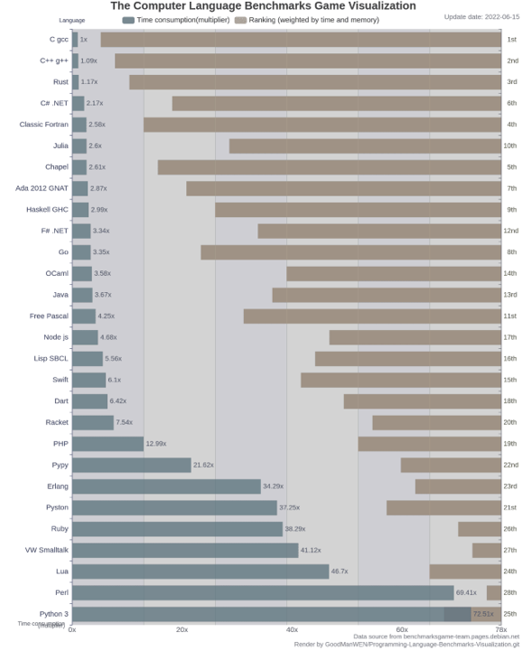

# Python与包管理

## 写在前头
Python不是一门强调语法的语言  
完全没有接触过Python的同学也不用专门去听网课或者查阅文档，懂得一些最基础的语法其实就可以了，更高级的用法可以用到再查

## 了解Python的优缺点
### Python的缺点
Python的缺点很明显，那就是慢，而且不是一般的慢  
所以我们一般不会用Python去写数据结构

### Python的优点
Python的缺点虽然显著，但仍然有那么多人喜欢Python
为什么？  
这得益于Python简单的语法与强大的库    

Python库是一些由其他人编写好的Python文件，内部包含了许多有用的函数，所以使用Python，我们不必重复造轮子的苦活  
Python相对于其他语言最幸福的一点就是，我们只用导入库后添加一两行代码就能完成其他语言几百行才能完成的工作  
Python适用于人工智能的开发，很大程度得益于庞大而完善的人工智能库  
常用的Python库：
* numpy
* pytorch
* pandas
 * matplotlib
* ……

## Python的包管理
寻常我们下载的Python，只有一个单独的Python环境，所有我们下载的Python库都储存在根目录下，这会导致一个问题：  
部分库对于Python的版本有特定要求，不同库对于Python的要求会产生冲突  
这就需要我们配置多个Python环境
### 不寻常做法（没人会这么做）
如果你是绝世狠人，你可以下载很多个不同版本的Python，精确手操包管理  
机枪手向前移动五米
### 寻常做法
除此之外，我们可以使用强大的包管理工具：  
* Anaconda
* Miniconda  
>Miniconda是Anaconda的简化版本，Anaconda会自带一个装好了一些关于数据处理的Python库，因此大小较大，而Miniconda只会带一个最基础的Python

我们可以用anaconda自由创建使用不同的Python环境  
#### 常用的conda命令
进入环境
```cmd
activate [env]
```
创建新环境
```cmd
conda create -n [env] python==xx
```
列出环境中的库
```cmd
conda list
```
列出所有的环境
```cmd
conda env list
```
下载库
>由于直接下载Python库速度较慢（真的很慢），所以我们一般会更换下载的渠道，即更换镜像源  
>```pip config set global.index-url https://pypi.tuna.tsinghua.edu.cn/simple/```  
>我们一般更换清华源就可以
```cmd
conda install 
pip install 
```


