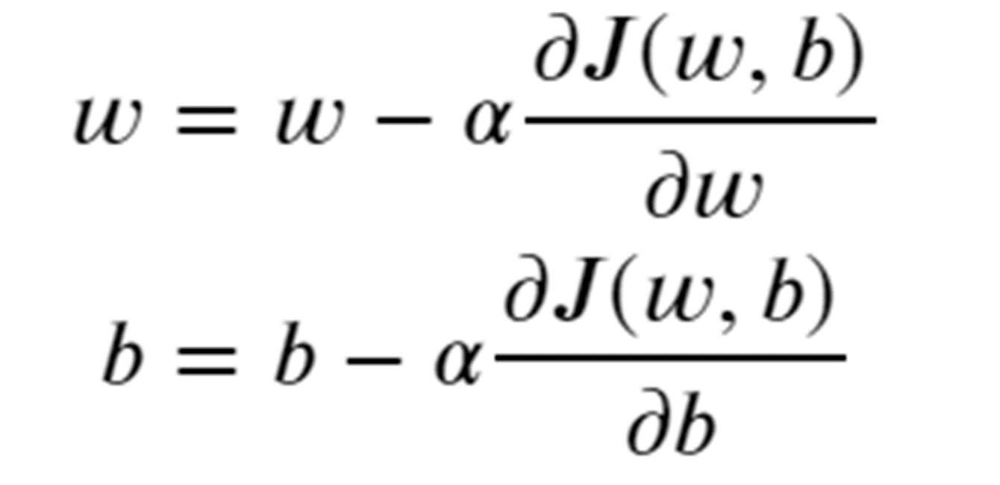

# 机器学习

## 什么是机器学习
学习人工智能，要从机器学习开始了解  
机器学习是什么

机器学习的本质就是使用计算机模拟或实现人类学习活动  
狭义一些理解就是用函数去拟合样本  

我们的重点就在于求出函数这个黑盒

## 损失函数
如果要使函数预测得尽可能准，首先我们需要给“预测得准”做一个定义  
给出另一个函数对于这个预测函数进行计算，用得出结果的大小来量化评估  
即损失函数  
  
代码实现
```python
def compute_cost(x, y, w, b):
   
    m = x.shape[0] 
    cost = 0
    
    for i in range(m):
        f_wb = w * x[i] + b
        cost = cost + (f_wb - y[i])**2
    total_cost = 1 / (2 * m) * cost

    return total_cost
```

## 梯度下降
在准备好样本、损失函数之后，我们便可以尝试得到一个较好的预测函数  
为了得到较好的预测函数，我们需要  
梯度下降法  
### 数学基础
了解梯度下降法前，我们需要一些基本的高数知识  
高数下册的知识：
偏导数以及梯度  
* 偏导数  
不想写了，想了解百度或者看高数下册
* 梯度  
梯度是一个向量，表示某一函数在该点处的方向导数沿着该方向取得最大值,
即函数在该点处沿着该方向变化最快，变化率最大  
更多去翻高数下册

### 具体实现
计算梯度

```python
def compute_gradient(x, y, w, b): 
    """
    Computes the gradient for linear regression 
    Args:
      x (ndarray (m,)): Data, m examples 
      y (ndarray (m,)): target values
      w,b (scalar)    : model parameters  
    Returns
      dj_dw (scalar): The gradient of the cost w.r.t. the parameters w
      dj_db (scalar): The gradient of the cost w.r.t. the parameter b     
     """
    
    m = x.shape[0]    
    dj_dw = 0
    dj_db = 0
    
    for i in range(m):  
        f_wb = w * x[i] + b 
        dj_dw_i = (f_wb - y[i]) * x[i] 
        dj_db_i = f_wb - y[i] 
        dj_db += dj_db_i
        dj_dw += dj_dw_i 
    dj_dw = dj_dw / m 
    dj_db = dj_db / m 
        
    return dj_dw, dj_db
```
进行梯度下降，更新参数

```python
def gradient_descent(x, y, w_in, b_in, alpha, num_iters, cost_function, gradient_function): 
    
    b = b_in
    w = w_in
    
    for i in range(num_iters):
        # Calculate the gradient and update the parameters using gradient_function
        dj_dw, dj_db = gradient_function(x, y, w , b)     

        # Update Parameters using equation (3) above
        b = b - alpha * dj_db                            
        w = w - alpha * dj_dw                            
 
    return w, b
```
## 写在后面
今天的课程最多只是带大家了解一下梯度下降是什么，从零开始想要完全理解几乎是不可能的  
如果对于这方面感兴趣，可以去课下查阅一下相关的资料  
以及推荐一下初步了解机器学习非常好的课程  
[Supervised Machine Learning: Regression and Classification](https://www.bilibili.com/video/BV1yW4y1k7Uq/?spm_id_from=333.337.search-card.all.click&vd_source=b041326d19f5e54c30efbed045ebab1f)


